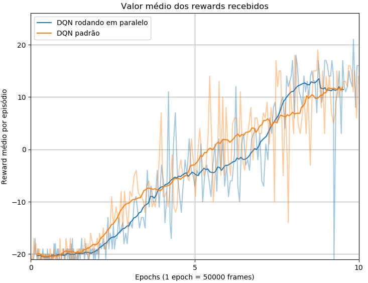

# Reinforcement-Learning
## Características do código

- Modo de execução em paralelo do algoritmo de RL disponível.
- Ambientes bidimensionais ([OpenAi Gym](https://github.com/openai/gym)) e tridimensionais ([ViZDoom](https://github.com/mwydmuch/ViZDoom)) para o treinamento e teste de agentes.
- Configuração do treinamento/teste do agente via comandos no terminal ou via arquivos de configuração .cfg.
- Armazenamento de informações do treinamento em arquivos .csv e dos pesos das redes neurais como .h5.
- Facilidade e robustez para definir os hiperparâmetros sem a necessidade de modificar o código.
- Facilidade para a criação de arquiteturas de redes neurais sem a necessidade de modificar o código principal.
- Simulação com frames monocromáticos ou coloridos (RGB)
- Armazenamento dos episódios ao longo do treinamento e dos estados ao longo de um teste como imagens .gif.
- Plot dos mapas de ativação, zonas de máxima ativação na imagem de entrada e imagens de entrada que maximizam determinados filtros para cada uma das camadas de convolução de um modelo treinado.
- Pesos pré-treinados para os jogos Pong e para os dois mapas de ViZDoom que acompanham esse repositório.

## Performance 
Para melhorar o tempo de processamento gasto no treinamento dos agentes foi desenvolvido uma abordagem para o algoritmo de reinforcement learning rodar em paralelo. Essa abordagem consiste basicamente em amostrar as experiências da replay memory em paralelo enquanto o algoritmo de decisão é executado, assim quanto chegamos na parte de treinamento da rede neural o custo computacional da amostragem já foi executado. A seguir temos algumas imagens comparativas entre as performances em frames/segundo do modo serial (single-threading) e paralelo (multi-threading) no treinamento de agente para jogar o jogo de Atari 2600 Pong. 

<p align="center">
 
</p>
*Os testes de performance foram realizado em cpu core i7 4790K e gpu nvidia geforce gtx 970*


Como podemos observar na imagem abaixo, embora a versão em paralelo introduza um "atraso" de uma amostragem, ambos os algoritmos aprenderam com sucesso a jogar o jogo Pong.

<p align="center">
 
</p>

## Instalação
O código foi todo escrito e testado em python 3.6 com Windows 10. Para execução do código as seguintes bibliotecas se fazem necessárias:

````
Tensorflow (cpu ou gpu)
Keras
Pandas
Imageio
OpenCV
Matplotlib
OpenAI Gym
ViZDoom
````

Para a instalação das bibliotecas acima recomenda-se criar um [ambiente virtual](https://conda.io/docs/user-guide/tasks/manage-environments.html) com o [miniconda](https://conda.io/docs/user-guide/install/index.html). Com o ambiente virtual ativado a instalação das bibliotecas com o miniconda pode ser feita com os seguintes comandos:
Versão cpu do tensorflow
````
conda install tensorflow
````
Versão gpu do tensorflow
````
conda install tensorflow-gpu
````
Para as demais bibliotecas
````
conda install keras
conda install pandas
conda install imageio
conda install opencv
conda install matplotlib
````
Para a instalação da biblioteca open ai gym em conjunto com o ambiente de ATARI 2600 no windows, utiize o seguintes comandos:
````
pip install gym
pip install --no-index -f https://github.com/Kojoley/atari-py/releases atari_py
````
Para mais detalhes sobre a execução dos jogos de atari no windows, consultar esse [link](https://stackoverflow.com/questions/42605769/openai-gym-atari-on-windows).

Para a instalação do ViZDoom no windows consultar esse [link](https://github.com/mwydmuch/ViZDoom/blob/master/doc/Building.md#windows_bin)

Uma vez com todas as bibliotecas instaladas e o ambiente virtual configurado, basta dar download ou clonar esse repositório e executar o arquivo Base_agent.py para o treinamento de um agente com o algoritmo de reinforcement learning DQN ou DRQN.


## Referências
Se esse código foi útil para sua pesquisa, por favor considere citar:
```
@misc{LVTeixeira,
  author = {Leonardo Viana Teixeira},
  title = {Desenvolvimento de um agente inteligente para exploração autônoma de ambientes 3D via Visual Reinforcement Learning},
  year = {2018},
  publisher = {GitHub},
  journal = {GitHub repository},
  url = {https://github.com/Leonardo-Viana/Reinforcement-Learning},
}
```

## Referências bibliográficas

- <a name = "[1]"></a>[1] Volodymyr Mnih, Koray Kavukcuoglu, David Silver, Andrei A Rusu, Joel Veness,
Marc G Bellemare, Alex Graves, Martin Riedmiller, Andreas K Fidjeland, Georg
Ostrovski, et al. [Human-level control through deep reinforcement learning](https://www.nature.com/articles/nature14236). Nature,
518(7540):529, 2015.
- <a name = "[2]"></a>[2] Matthew Hausknecht and Peter Stone. [Deep recurrent q-learning for partially observable mdps](https://arxiv.org/abs/1507.06527). CoRR, abs/1507.06527, 2015.
- <a name = "[3]"></a>[3] Max Lapan. Speeding up dqn on pytorch: how to solve pong in 30 minutes. 23 de
novembro 2017. Disponível em <https://medium.com/mlreview/speeding-up-dqn-on-pytorch-solving-pong-in-30-minutes-81a1bd2dff55>. Acesso em: 07 de novembro de 2018.
- <a name = "[4]"></a>[4] Daniel Seita. Frame Skipping and Pre-Processing for Deep Q-Networks on Atari 2600 Games. 25 de novembro de 2016. Disponível em <https://danieltakeshi.github.io/2016/11/25/frame-skipping-and-preprocessing-for-deep-q-networks-on-atari-2600-games/>. Acesso em: 04 de janeiro de 2019.
