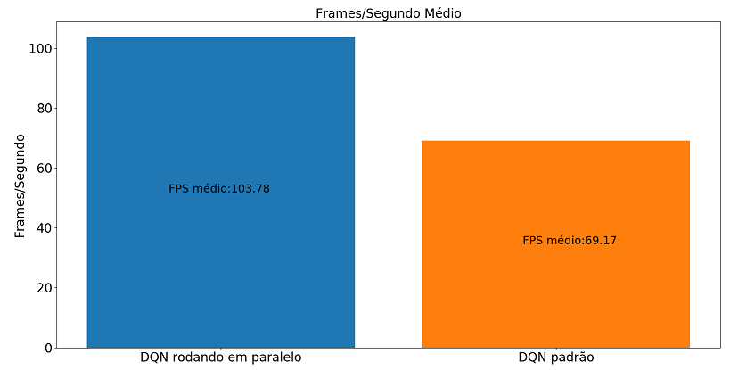
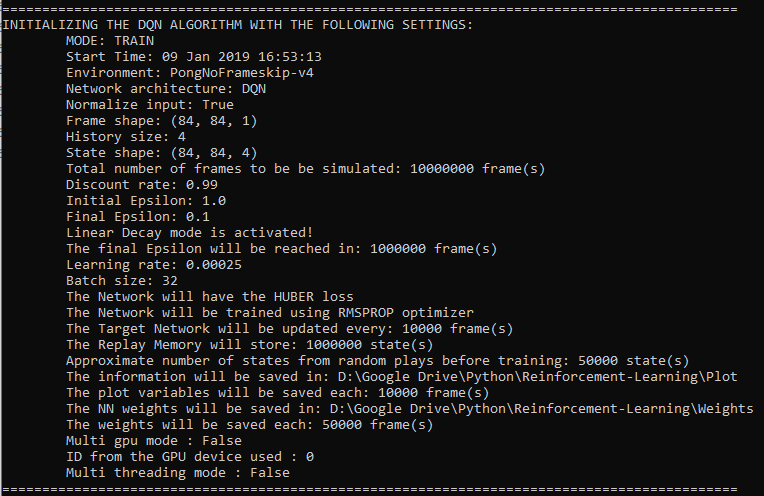

# Reinforcement-Learning
## Características do código

- Modo de execução em paralelo do algoritmo de RL disponível.
- Ambientes bidimensionais ([OpenAi Gym](https://github.com/openai/gym)) e tridimensionais ([ViZDoom](https://github.com/mwydmuch/ViZDoom)) para o treinamento e teste de agentes.
- Possibilidade de inserção de outros ambientes para o treinamento de agentes.
- Configuração do treinamento/teste do agente via comandos no terminal ou via arquivos de configuração .cfg.
- Armazenamento de informações do treinamento em arquivos .csv e dos pesos das redes neurais como .h5.
- Facilidade e robustez para definir os hiperparâmetros sem a necessidade de modificar o código.
- Facilidade para a criação de arquiteturas de redes neurais sem a necessidade de modificar o código principal.
- Simulação com frames monocromáticos ou coloridos (RGB)
- Armazenamento dos episódios ao longo do treinamento e dos estados ao longo de um teste como imagens .gif.
- Plot dos mapas de ativação, zonas de máxima ativação na imagem de entrada e imagens de entrada que maximizam determinados filtros para cada uma das camadas de convolução de um modelo treinado.
- Pesos pré-treinados para os jogos Pong e para os dois mapas de ViZDoom que acompanham esse repositório.

## Performance 
Para melhorar o tempo de processamento gasto no treinamento dos agentes foi desenvolvido uma abordagem para o algoritmo de reinforcement learning rodar em paralelo. Essa abordagem consiste basicamente em amostrar as experiências da replay memory em paralelo enquanto o algoritmo de decisão é executado, assim quanto chegamos na parte de treinamento da rede neural o custo computacional da amostragem já foi executado. A seguir temos algumas imagens comparativas entre as performances em frames/segundo do modo serial (single-threading) e paralelo (multi-threading) no treinamento de agente para jogar o jogo de Atari 2600 Pong. 

<p align="center">
 
</p>
*Os testes de performance foram realizado em cpu core i7 4790K e gpu nvidia geforce gtx 970*


Como podemos observar na imagem abaixo, embora a versão em paralelo introduza um "atraso" de uma amostragem, ambos os algoritmos aprenderam com sucesso a jogar o jogo Pong.

<p align="center">
 
</p>

## Instalação
O código foi todo escrito e testado em python 3.6 com Windows 10. Para execução do código as seguintes bibliotecas se fazem necessárias:

````
Tensorflow (cpu ou gpu)
Keras
Pandas
Imageio
OpenCV
Matplotlib
OpenAI Gym
ViZDoom
````

Para a instalação das bibliotecas acima recomenda-se criar um [ambiente virtual](https://conda.io/docs/user-guide/tasks/manage-environments.html) com o [miniconda](https://conda.io/docs/user-guide/install/index.html). Com o ambiente virtual ativado a instalação das bibliotecas com o miniconda pode ser feita com os seguintes comandos:
Versão cpu do tensorflow
````
conda install tensorflow
````
Versão gpu do tensorflow
````
conda install tensorflow-gpu
````
Para as demais bibliotecas
````
conda install keras
conda install pandas
conda install imageio
conda install opencv
conda install matplotlib
````
Para a instalação da biblioteca open ai gym em conjunto com o ambiente de ATARI 2600 no windows, utiize o seguintes comandos:
````
pip install gym
pip install --no-index -f https://github.com/Kojoley/atari-py/releases atari_py
````
Para mais detalhes sobre a execução dos jogos de atari no windows, consultar esse [link](https://stackoverflow.com/questions/42605769/openai-gym-atari-on-windows).

Para a instalação do ViZDoom no windows consultar esse [link](https://github.com/mwydmuch/ViZDoom/blob/master/doc/Building.md#windows_bin)

Uma vez com todas as bibliotecas instaladas e o ambiente virtual configurado, basta dar download ou clonar esse repositório e executar o arquivo Base_agent.py para o treinamento de um agente com o algoritmo de reinforcement learning DQN ou DRQN.

## Utilização
Para começar o treinamento do agente em seu ambiente de escolha basta executar o arquivo Base_agent.py com as configurações de treinamento desejadas. Essas opções podem ser passadas via comandos de terminal ou escritas no arquivo Base_agent.cfg. **Caso algum comando de terminal seja enviado, a configuração de execução do script será feita exclusivamente por eles, e os parâmetros não enviados terão seus valores atribuídos como default.** Se nenhum parâmetro for enviado via terminal, o script procurará por um arquivo de mesmo nome com extensão .cfg. Dentro deste arquivo caso encontre configurações validas às mesmas serão lidas e de forma similar a configuração via terminal, os valores não definidos serão atribuídos aos seus valores default. Se nenhuma das opções de configuração acima seja feita, o agente será treinado com seus valores default, ou seja, serão utilizados os hiperparâmetros demonstrados no artigo [Human-level control through deep reinforcement learning](https://www.nature.com/articles/nature14236) para o treinamento de um agente no jogo Pong.

A grande vantagem de se utilizar o arquivo .cfg é o fato de não precisar copiar e colar (ou escrever) comandos gigantes no terminal, além de facilitar o debug em caso de algum contratempo na inicialização de algum hiperparâmetro. Mais detalhes sobre a configuração dos arquivos .cfg pode ser vista no tópico [Arquivos CFG].

Antes do começo do treinamento do agente, o script exibe um resumo das configurações e hiperparâmetros que serão utilizados em sua execução, desta forma, é possível checar se esta tudo de acordo com o planejado.

<p align="center">
 
</p>


## Definindo a arquitetura da rede neural
É possível definir sua propria arquitetura de rede neural para o treinamento do seu agente. Para isso basta criar dentro do arquivo Networks.py sua própria rede neural como uma função utilizando a biblioteca [Keras](https://keras.io/) **(A arquitetura pode ser criada com a functional ou sequential API)**. Dessa forma, você pode experimentar de forma rápida e sem complicações os efeitos de diferentes arquiteturas, como por exemplo, camadas recorrentes, métodos de regularização (Dropout, distância L2), normalização, batch normalization no aprendizado do agente. Após definida sua arquitetura, o nome da função deve ser enviado como um argumento via comando de terminal com o comando:

````
python Base_agent.py --network_model "<nome_da_sua_funcao>"
````
Ou escrito no arquivo Base_agent.cfg como:
````
network_model = <nome_da_sua_funcao>
````
Caso a arquitetura possua camadas do tipo recorrente é necessario atribuir o valor verdadeiro a variável **is_recurrent** na hora da execução do script principal. Desta forma caso sua arquitetura seja recorrente o comando será:

````
python Base_agent.py --network_model "<nome_da_sua_funcao_recorrente> --is_recurrent True"
````
Ou escrito no arquivo Base_agent.cfg como:
````
network_model = <nome_da_sua_funcao_recorrente>
is_recurrent = True
````

### Requisitos
A rede neural desensolvida deve ter como entrada um tensor de dimensão **state_input_shape** e um nome igual a **name**, além da possibilidade da escolha se os pixel das entrada serão normalizados ou não pela variável **normalize** e deve possuir como saída um tensor com formato igual **actions_num**. A função deve ter como retorno o modelo Keras implementado pela função. Os parâmetros **state_input_shape**, **name**, **actions_num** e **normalize** são enviados ao arquivo Networks.py pelo script principal, que por sua vez, espera como retorno o modelo implementado. A seguir temos um exemplo de implementação da arquitetura (com a functional API do Keras) utilizada no artigo [Human-level control through deep reinforcement learning](https://www.nature.com/articles/nature14236) dentro de uma função chamada **DQN**:

````
def DQN(state_input_shape, actions_num, name, normalize):
    input = Input(state_input_shape, name=name)
    if normalize:
        lamb = Lambda(lambda x: (2 * x - 255) / 255.0, )(input)
        conv_1 = Conv2D(32, (8, 8), strides=(4, 4), activation='relu')(lamb)
    else:
        conv_1 = Conv2D(32, (8, 8), strides=(4, 4), activation='relu')(input)
    conv_2 = Conv2D(64, (4, 4), strides=(2, 2), activation='relu')(conv_1)
    conv_3 = Conv2D(64, (3, 3), strides=(1, 1), activation='relu')(conv_2)
    conv_flattened = Flatten()(conv_3)
    hidden = Dense(512, activation='relu')(conv_flattened)
    output = Dense(actions_num)(hidden)
    model = Model(inputs=input, outputs=output)
    return model
````
Essa é a arquitetura padrão executada, caso nenhuma outra seja especificada na execução do agente. Dentro do arquivo [Networks.py](Networks.py) há outras arquiteturas de redes neurais (com camadadas recorrentes, métodos de normalização) que servem como exemplo.
## Exemplos
A seguir serão apresentados alguns exemplos. Todos os parâmetros podem ser passados via comandos de terminal na execução do script ou via arquivo .cfg (como visto na sessão [Utilização](https://github.com/Leonardo-Viana/Reinforcement-Learning#utiliza%C3%A7%C3%A3o)). Relembrando que os parâmetros não configurados possuem seus valores iguais ao default. Para mais informações sobre cada opção disponivel e seus valores default verificar o [DOC](www.somelink.com) ou utilizar o comando de terminal:
````
python Base_agent.py --help
````
### Pong treinado com DQN básico
Para treinar um agente utilizando os hiperparâmetros especificados pelo excelente artigo [Speeding up DQN on PyTorch: how to solve Pong in 30 minutes](https://medium.com/mlreview/speeding-up-dqn-on-pytorch-solving-pong-in-30-minutes-81a1bd2dff55) basta executar o script Base_agent.py com seguintes comandos no terminal:

````
python Base_agent.py --agent_name "DQNPong30" --num_simul_frames 1000000 --e_min 0.02 --e_lin_decay 100000 --target_update 1000 --num_states_stored 100000 --num_random_play 10000 --optimizer adam --lr 1e-4 --random_seed 1
````
Outra alternativa seria a escrita destes comandos dentro do arquivo Base_agent.cfg da seguinte forma:
```
agent_name = DQNPong30
num_simul_frames = 1000000
e_min = 0.02
e_lin_decay = 100000
target_update = 1000
num_states_stored = 100000
num_random_play = 10000
optimizer = adam
lr = 1e-4
random_seed = 1
```
E depois basta executar o script Base_agent.py sem nenhum argumento:
````
python Base_agent.py
````
Ambas as opções de configuração irão treinar o agente com hiperparâmetros especificados pelo artigo acima com a random seed fixa (em 1) durante 1 milhão de frames. 

### Treinamento de um agente dentro do VizDoom 
Esse repositório possui em suas dependencias dois mapas para o jogo Doom, **labyrinth e labyrinth_test**, que possuem como objetivo ensinar o agente a navegação tridimensional (mais detalhes sobre esses mapas no tópico [Mapas de Doom]). Para treinar o agente na fase labyrinth utilizando a arquitetura de rede neural DRQN proposta por [POR LINK do ARTIGO DRQN] podemos utilizar os seguintes comandos:
````
python Base_agent.py --env Doom --agent_name grayh4-LSTM --network_model DRQN --is_recurrent True --optimizer adam --lr 1e-4 --num_random_play 50000 --num_states_stored 250000 --e_lin_decay 250000 --num_simul_frames 5000000 --steps_save_weights 50000 --history_size 4 --input_shape (84,84,1) --to_save_episodes True steps_save_episodes 100 --multi_threading True
````
Ou podemos escrever dentro do arquivo Base_agent.cfg os seguintes comandos:
````
env = Doom
agent_name = grayh4-LSTM
network_model = DRQN
is_recurrent = True
optimizer = adam
lr = 1e-4
num_random_play = 50000
num_states_stored = 250000
e_lin_decay = 250000
num_simul_frames = 5000000
steps_save_weights = 50000
history_size = 4
input_shape = (84,84,1)
to_save_episodes = True
steps_save_episodes = 100
multi_threading = True
````
E depois basta executar o script Base_agent.py sem nenhum argumento:
````
python Base_agent.py
````
### Testando um agente treinado
O script Base_agent.py possui dois modos de execução treinamento (**train**) ou teste (**test**). O modo de treinamento é o default no qual o agente é treinado utilizando a premissa do reinforcement learning. Já no modo teste, a maioria dos hiperparâmetros de aprendizado são ignorados, o objetivo deste modo é o teste de um agente treinado. A seguir vemos um exemplo do teste de um agente treinado com o DQN (os pesos treinados desta simulação encontram-se neste repositório) com o jogo serendo renderizado:
````
python Base_agent.py --agent_mode test --env Doom --load_weights True --weights_load_path ../Weights/Pretrained/Doom/Labyrinth/grayh4-weights-Doom-labyrinth-5000000.h5 --agent_name doomh4 --to_render True --to_save_states False
````
````
agent_mode = test
env = Doom
load_weights = True
weights_load_path = ../Weights/Pretrained/Doom/Labyrinth/grayh4-weights-Doom-labyrinth-5000000.h5
agent_name = doomh4
to_render = True
to_save_states = False
````
## Referências
Se esse código foi útil para sua pesquisa, por favor considere citar:
```
@misc{LVTeixeira,
  author = {Leonardo Viana Teixeira},
  title = {Desenvolvimento de um agente inteligente para exploração autônoma de ambientes 3D via Visual Reinforcement Learning},
  year = {2018},
  publisher = {GitHub},
  journal = {GitHub repository},
  url = {https://github.com/Leonardo-Viana/Reinforcement-Learning},
}
```
