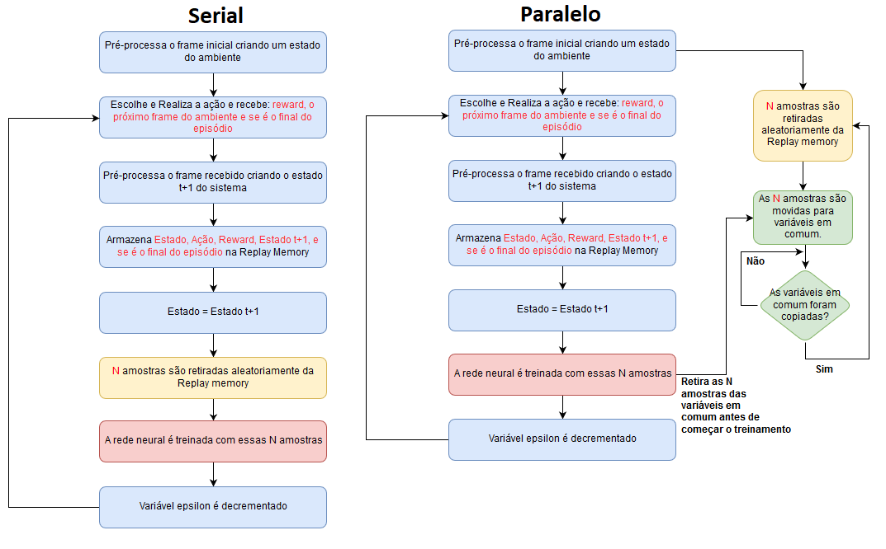

# Reinforcement-Learning
Neste repositório é feita a implementação dos algoritmos de deep reinforcement learning DQN e DRQN em python 3.6. O deep reinforcement learning é uma técnica que objetiva treinar uma inteligência artificial, chamado de agente, a completar da melhor maneira possível um determinado objetivo dentro de um ambiente normalmente estocástico possuindo como entrada os pixels da tela do ambiente. Nesta metodologia, o agente utiliza redes neurais para aprender pelo metodo de tentativa e erro qual a melhor ação a ser tomada em cada estado (imagem da tela do ambiente) para maximizar a premiação total. 

Embora exitam inúmeros scripts que implementem os algoritmos descritos acima, a maioria os implementa de uma maneira simples muitas vezes sem se preucupar com o desempenho ou quanto tempo de simulação (e consequentemente a energia gasta no processo) para treinar os agentes. Performance também é importante nos algoritmos de inteligência artificial afinal existem várias formas de implementar o mesmo algoritmo. Para os scripts nesse repositório foram procuradas as melhores formas para reduzir o tempo de simulação gasto para treinar os agentes, aproveitando o máximo da computação vetorizada pelas bibliotecas Numpy e Tensorflow. Foi desenvolvido um modo simples, para diminuir consideravelmente (em média de 35%) o tempo necessário de simulação, ao paralelizar de forma simples os algoritmos DQN/DRQN([mais detalhes no tópico performance](#performance)). 

<p align="center">
 
</p>

## Características do código

- [Modo de execução em paralelo do algoritmo de RL disponível](#performance)(Treinamento em média 35% mais rápido que o modo padrão).
- Ambientes bidimensionais ([OpenAi Gym](https://github.com/openai/gym)) e tridimensionais ([ViZDoom](https://github.com/mwydmuch/ViZDoom)) para o treinamento e teste de agentes.
- [Dois mapas exclusivos para o ViZDoom simulando um problema de robótica móvel](https://github.com/Leonardo-Viana/Reinforcement-Learning/blob/master/docs/ptbr/map_ptbr.md).
- Configuração do treinamento/teste do agente via comandos no terminal ou via arquivos de configuração .cfg (Ver as sessões de [ exemplos](https://github.com/Leonardo-Viana/Reinforcement-Learning/blob/master/docs/ptbr/examples_ptbr.md) e a [documentação](https://github.com/Leonardo-Viana/Reinforcement-Learning/blob/master/docs/ptbr/doc_ptbr.md)).
- Armazenamento de informações do treinamento em arquivos .csv ([mais detalhes aqui](https://github.com/Leonardo-Viana/Reinforcement-Learning/blob/master/docs/ptbr/doc_ptbr.md#steps_save_plot)) e dos pesos das redes neurais como .h5.
- Facilidade e robustez para definir os hiperparâmetros sem a necessidade de modificar o código (Ver a sessão dos [arquivos .cfg](https://github.com/Leonardo-Viana/Reinforcement-Learning/blob/master/docs/ptbr/cfg_ptbr.md)).
- Facilidade para a criação de arquiteturas de redes neurais sem a necessidade de modificar o código principal (Ver a sessão [Definindo a arquitetura da rede neural](https://github.com/Leonardo-Viana/Reinforcement-Learning/blob/master/docs/ptbr/nn_ptbr.md)).
- Simulação com frames monocromáticos ou coloridos (RGB) ([mais detalhes aqui](https://github.com/Leonardo-Viana/Reinforcement-Learning/blob/master/docs/ptbr/doc_ptbr.md#input_shape)).
- Armazenamento dos [episódios ao longo do treinamento](https://github.com/Leonardo-Viana/Reinforcement-Learning/blob/master/docs/ptbr/doc_ptbr.md#-to_save_episodes) e dos [estados ao longo de um teste](https://github.com/Leonardo-Viana/Reinforcement-Learning/blob/master/docs/ptbr/doc_ptbr.md#-to_save_states) como imagens .gif.
- Pesos pré-treinados para o mapa labyrinth de ViZDoom acompanhando esse repositório ([mais informações aqui](https://github.com/Leonardo-Viana/Reinforcement-Learning/blob/master/docs/ptbr/info-weights_ptbr.md)).
- Plot dos mapas de ativação, zonas de máxima ativação na imagem de entrada e imagens de entrada que maximizam determinados filtros para cada uma das camadas de convolução de um modelo treinado.
<p align="center">
 
</p>
*Clique na imagem para abrir a imagem em tamanho real.


## <a name="performance"></a>  Performance 

Durante o desenvolvimento do algoritmo foram buscadas as melhores maneiras de aumentar o processamento de frames/segundo. A parte que demanda mais tempo de processamento é a utilização das redes neurais. Durante o cálculo do erro de treinamento das redes neurais, necessitamos dos resultados de ambas as redes neurais Q e Q_target para todas as N amostras colhidas da replay memory. Logo, essa parte do código foi pensada de forma a aproveitar o máximo da computação vetorizada, assim *for loops* em python nativo foram substituídos pela vetorização em Numpy (principal biblioteca matemática do python) e posteriormente foram mudados para vetorização em Tensorflow. Assim se o usuário possuir uma GPU, o código tomará vantagem do paralelismo massivo fornecida pelas mesmas para a execução mais rápida do algoritmo. 

Depois do uso da redes neurais, a parte que mais utiliza recursos de processamento é a amostragem das experiências a medida que replay memory aumenta. Para uma atenuação deste problema foi desenvolvido uma abordagem de processamento em paralelo (multi-threading) para os algoritmos DQN e DRQN. O modo em paralelo consiste basicamente em amostrar as experiências da replay memory em paralelo enquanto o algoritmo de decisão é executado, assim quanto chegamos na parte de treinamento da rede neural o custo computacional da amostragem já foi executado. A figura a seguir demonstra como são executadas as abordagens serial (single-threading) e paralelo (multi-threading). 
<p align="center">
 
</p>
A seguir temos algumas imagens comparativas entre as performances em frames/segundo do modo serial e paralelo no treinamento de agente para jogar o jogo de Atari 2600 Pong. Como pode ser visto a versão em paralelo possui um tempo em média 35% menor de simulação que a versão padrão (serial).

|Processamento|Frames/segundo médio|Tempo de simulação|
| ---         | ---                | ---              |
| Serial      |                    |                  |
| Paralelo    |                    |                  |                  

*Os testes de performance foram realizado em cpu core i7 4790K e gpu nvidia geforce gtx 970*

## Documentação

- [Instalação](https://github.com/Leonardo-Viana/Reinforcement-Learning/blob/master/docs/ptbr/installation_ptbr.md)
- [Documentação](https://github.com/Leonardo-Viana/Reinforcement-Learning/blob/master/docs/ptbr/doc_ptbr.md)
- [Arquivos de configuração .CFG](https://github.com/Leonardo-Viana/Reinforcement-Learning/blob/master/docs/ptbr/cfg_ptbr.md)
- [Definindo a arquitetura da rede neural](https://github.com/Leonardo-Viana/Reinforcement-Learning/blob/master/docs/ptbr/nn_ptbr.md)
- [Informações sobre os mapas deste repositório (ViZDoom)](https://github.com/Leonardo-Viana/Reinforcement-Learning/blob/master/docs/ptbr/map_ptbr.md)
- [Informações sobre os pesos pré-treinados](https://github.com/Leonardo-Viana/Reinforcement-Learning/blob/master/docs/ptbr/info-weights_ptbr.md)
- [Exemplos](https://github.com/Leonardo-Viana/Reinforcement-Learning/blob/master/docs/ptbr/examples_ptbr.md)


## Referências
Se esse código foi útil para sua pesquisa, por favor considere citar:
```
@misc{LVTeixeira,
  author = {Leonardo Viana Teixeira},
  title = {Desenvolvimento de um agente inteligente para exploração autônoma de ambientes 3D via Visual Reinforcement Learning},
  year = {2018},
  publisher = {GitHub},
  journal = {GitHub repository},
  url = {https://github.com/Leonardo-Viana/Reinforcement-Learning},
}
```

## Referências bibliográficas

- <a name = "[1]"></a>[1] Volodymyr Mnih, Koray Kavukcuoglu, David Silver, Andrei A Rusu, Joel Veness,
Marc G Bellemare, Alex Graves, Martin Riedmiller, Andreas K Fidjeland, Georg
Ostrovski, et al. [Human-level control through deep reinforcement learning](https://www.nature.com/articles/nature14236). Nature,
518(7540):529, 2015.
- <a name = "[2]"></a>[2] Matthew Hausknecht and Peter Stone. [Deep recurrent q-learning for partially observable mdps](https://arxiv.org/abs/1507.06527). CoRR, abs/1507.06527, 2015.
- <a name = "[3]"></a>[3] Max Lapan. Speeding up dqn on pytorch: how to solve pong in 30 minutes. 23 de
novembro 2017. Disponível em <https://medium.com/mlreview/speeding-up-dqn-on-pytorch-solving-pong-in-30-minutes-81a1bd2dff55>. Acesso em: 07 de novembro de 2018.
- <a name = "[4]"></a>[4] Daniel Seita. Frame Skipping and Pre-Processing for Deep Q-Networks on Atari 2600 Games. 25 de novembro de 2016. Disponível em <https://danieltakeshi.github.io/2016/11/25/frame-skipping-and-preprocessing-for-deep-q-networks-on-atari-2600-games/>. Acesso em: 04 de janeiro de 2019.
